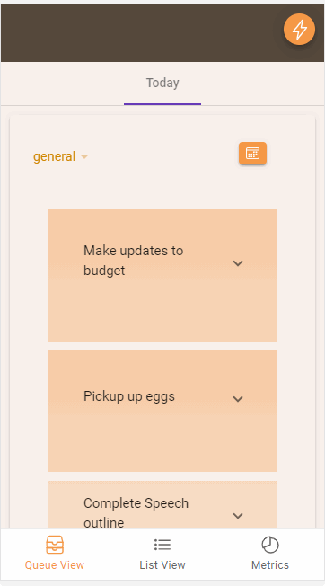
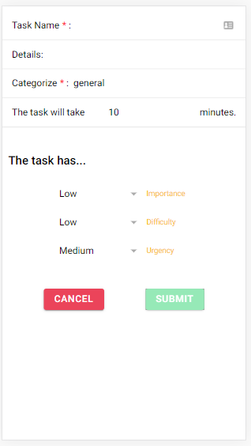

<!-- PROJECT LOGO -->
<br />
<p align="center">
  <a href="https://github.com/kevinmilly/QueueD">
    
  </a>

  <h3 align="center">Queue-D</h3>

  <p align="center">
    An awesome way to manage tasks
    <br />
    <a href="https://github.com/kevinmilly/QueueD"><strong>Explore the docs »</strong></a>
    <br />
    <br />
    <a href="readme-assets/nextaskdemo.gif">View Demo</a>
    ·
    <a href="https://github.com/kevinmilly/QueueD/issues">Report Bug</a>
    ·
    <a href="https://github.com/kevinmilly/QueueD/issues">Request Feature</a>
  </p>
</p>


<!-- TABLE OF CONTENTS -->
<details open="open">
  <summary>Table of Contents</summary>
  <ol>
    <li>
      <a href="#about-the-project">About The Project</a>
      <ul>
        <li><a href="#built-with">Built With</a></li>
      </ul>
    </li>
    <li>
      <a href="#getting-started">Getting Started</a>
      <ul>
        <li><a href="#prerequisites">Prerequisites</a></li>
        <li><a href="#generaluse">End User Setup</a></li>
        <li><a href="#installation">Developer Setup</a></li>
      </ul>
    </li>
    <li><a href="#usage">Usage</a></li>
    <li><a href="#roadmap">Roadmap</a></li>
    <li><a href="#contributing">Contributing</a></li>
    <li><a href="#license">License</a></li>
    <li><a href="#contact">Contact</a></li>
    <li><a href="#acknowledgements">Acknowledgements</a></li>
  </ol>
</details>


<!-- ABOUT THE PROJECT -->
## About The Project



I love the concept of productivity.  Task management to time is like budgeting to money; it helps you save and spend your resources.  There are a lot of great task management apps out there.  However, I found that there was room for an app that:

* Helped you focus on the most impactful tasks first
* Helped you schedule  your tasks more effectively
* Helped you see the metrics that mattered at a glance

This project is an attempt to fulfill these needs.  It's inspired by the <a href="https://en.wikipedia.org/wiki/Time_management#The_Eisenhower_Method">Eisenhower Matrix method</a>, the "Hardest task first" mindset/method, and <a href="https://en.wikipedia.org/wiki/Timeblocking">"Time-Blocking"</a>. 

With Queue-D, when you create a task, you must choose the Importance, Difficulty, and Urgency.



* Importance: This is a measurement based on your peception of the gravity of such a task; How serious
is it that you get this task done TODAY? 
* Difficulty: This is a measurement based on how involved you feel  you will be in this task or how draining
the task will be on your energy, time or patience.
* Urgency: This is a measurement taking into account the timing of this task's completion in relation to other tasks.  Do you need to get this done quickly or can it wait?

As you can see from the screenshot above, these questiosn are presented in a brief manner and unimposing interface.  With a brief moment, an additional step of intentionality when 'jotting' this task on your list; you give the app enough information to prioritize the task on your 'queue'.  

Tasks will arrange themselves vertically on your queue based on a summation of importance, difficulty, and urgency; the Most Urgent, the Most Difficult, and the Most Important will 'bubble' to the top.  With that being said, you will work from the top to the bottom as you complete your tasks, assured that you are handling the most impactful tasks FIRST.

You may notice that based on the level of 'Importance', 'Difficulty', and 'Urgency', the taks on the queue will vary in gradation of orange and thickness (height).  This helps identify tasks you need to hit in priority.


### What if I don't get to a task?

Another thing that affects the prioritization of a task is the duration of existence.  Naturally, a task that you don't get to over a duration of days would increase in priority; you can only procrastinate so much.  To reflect this, that task will eventually "bubble up" in priority, every day it remains on the queue.  No more losing track!

By the way, are you trying to truncate your work day?  Why should work the tradition 8 hours/day.  You can set how many hours you want to work per day.  Based on this setting, and the amount of time you estimate per task, Queue-D will load the queue as much as you day will allow.  Any additional tasks you create beyond your daily limit, will overflow until the next day.

### Need reminders?

Timeblocking allows you to use your calendar with task management.  By using the time-blocking feature you can integrate with your Google Calendar (based on the Google account  you signed in with).  The tasks will show up on your G-Cal based on the same order and color gradation.  Now you can take advantage of whatever defaults and settings you have set with your Google calendar (notifications, sharing, etc.)

### Additional Usage

#### Goal-Based Tasks


Sometimes you have Goal-based tasks that are interspersed between simple ad-hoc tasks tha occur from day to day.  These goal-based tasks have a more long-term meaning, however usually, need to relate to your 'one off' tasks.  In line with that, you can 'reverse-engineer' a goal down to a milestone and then to a task with Queue-D; these tasks will be included on your day to day queue accordingly.


#### Metrics

Have you ever wondered what tasks you tend to shy away from completing vs. the ones you hurry to complete?
What are your most productive times in day?

Having this insight will inform your future decisions!  Check out the 'Metrics' section.

<!-- ROADMAP -->
## Roadmap

*It would be great to further flesh out the 'Metrics' section, certaintly additonal information can be extracted from the data to benefit our productivity.

*General UX is an ongoing project.

*Testing is being conduced on task completion gamification and goal-based tasks.

See the [open issues](https://github.com/kevinmilly/QueueD/issues) for a list of proposed features (and known issues).


<!-- GETTING STARTED -->
## Getting Started

Depending how you want to get involved, below are some steps if you want to help with development or step
up your task management game!


### End User Setup

1. Visit the app at, https://queue-d-cloud.web.app/
2. Sign in with Google
3. Get to work!

### Developer Setup

1. Clone the repo
   ```sh
   git clone https://github.com/kevinmilly/Queue-D.git
   ```
2. Install NPM packages
   ```sh
   npm install
   ```

### Built With

* [Ionic Framework - Angular](https://ionicframework.com/docs/angular/your-first-app)
* [Firebase](https://firebase.google.com/)


<!-- CONTRIBUTING -->
## Contributing

Contributions are what make the open source community such an amazing place to be learn, inspire, and create. Any contributions you make are **greatly appreciated**.

Please feel free to contribute through code or through theory.  Everyone has their own thoughts in regards to how we can all become more productivity.  If you have thoughts in regards to ideas, please feel free to 'Create an Issue' or give feedback through a feature suggestion.


1. Fork the Project
2. Create your Feature Branch (`git checkout -b feature/AmazingFeature`)
3. Commit your Changes (`git commit -m 'Add some AmazingFeature'`)
4. Push to the Branch (`git push origin feature/AmazingFeature`)
5. Open a Pull Request


<!-- LICENSE -->
## License

Distributed under the MIT License. See `LICENSE` for more information.


<!-- CONTACT -->
## Contact

Kevin Smith - [Connect with me on LinkedIn](https://www.linkedin.com/in/ksmithtech/) - https://www.linkedin.com/in/ksmithtech/

Email me at: kevinmilly@gmail.com


